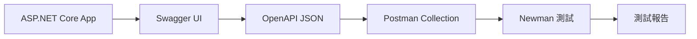

# Swagger 到 Newman 的完整工作流程

## 🔄 執行流程概述



## 步驟詳解

### 1️⃣ **啟動應用程式並產生 Swagger 文檔**
```bash
# 啟動 ASP.NET Core 應用程式
cd AspNetCore8Test
dotnet run
```

應用程式會在 `http://localhost:5198` 啟動，並自動產生：
- **Swagger UI**: `http://localhost:5198/swagger`
- **OpenAPI JSON**: `http://localhost:5198/swagger/v1/swagger.json`

### 2️⃣ **從 Swagger 匯出 OpenAPI 文檔**

#### 方法 A: 直接下載 JSON 文件
```bash
# 使用 PowerShell 下載 OpenAPI 規格
Invoke-WebRequest -Uri "http://localhost:5198/swagger/v1/swagger.json" -OutFile "openapi-spec.json"
```

#### 方法 B: 從 Swagger UI 匯出
1. 開啟 `http://localhost:5198/swagger`
2. 點擊右上角的 "Download" 或直接訪問 JSON 端點

### 3️⃣ **轉換 OpenAPI 到 Postman Collection**

#### 選項 A: 手動建立 (我們已經做了)
- ✅ 已建立 `Products-API.postman_collection.json`
- ✅ 包含所有 API 端點和測試

#### 選項 B: 使用轉換工具
```bash
# 安裝 openapi-to-postman
npm install -g openapi-to-postman-cli

# 轉換 OpenAPI 到 Postman
openapi2postman -s openapi-spec.json -o converted-collection.json
```

### 4️⃣ **使用 Newman 執行測試**

#### 基本執行
```bash
cd newman-tests
newman run Products-API.postman_collection.json --environment development.postman_environment.json
```

#### 產生詳細報告
```bash
newman run Products-API.postman_collection.json \
    --environment development.postman_environment.json \
    --reporters cli,html,json \
    --reporter-html-export test-report.html \
    --reporter-json-export test-results.json
```

#### 使用我們的自動化腳本
```powershell
# PowerShell 腳本
.\run-newman-tests.ps1

# 或批次檔
run-newman-tests.bat
```

## 🔄 **持續開發流程**

### 開發階段流程：
1. **修改 API** → 更新 Controller/Models
2. **重啟應用程式** → `dotnet run`
3. **檢查 Swagger** → 驗證 API 文檔更新
4. **更新測試** → 修改 Postman Collection (如需要)
5. **執行 Newman** → 驗證所有功能
6. **查看報告** → 分析測試結果

### 自動化流程：
```bash
# 一鍵測試腳本
./full-api-test.ps1
```

## 📊 **目前的測試覆蓋**

我們的 Postman Collection 涵蓋：

✅ **CRUD 操作**
- GET /api/Products (取得所有商品)
- POST /api/Products (建立商品)
- GET /api/Products/{id} (取得特定商品)
- PUT /api/Products/{id} (更新商品)
- DELETE /api/Products/{id} (刪除商品)

✅ **驗證測試**
- 資料驗證錯誤處理
- 狀態碼驗證
- 回應內容驗證
- 效能測試 (回應時間)

✅ **錯誤處理**
- 404 錯誤 (商品不存在)
- 400 錯誤 (驗證失敗)
- 邊界條件測試

## 🚀 **進階功能**

### 環境管理
- `development.postman_environment.json` - 開發環境
- 可建立 `staging.postman_environment.json` - 測試環境
- 可建立 `production.postman_environment.json` - 生產環境

### CI/CD 整合
```yaml
# GitHub Actions 範例
- name: Run API Tests
  run: |
    newman run newman-tests/Products-API.postman_collection.json \
      --environment newman-tests/development.postman_environment.json \
      --reporters cli,json \
      --reporter-json-export test-results.json
```

### 測試資料管理
- 使用 Pre-request Scripts 設置測試資料
- 使用 Test Scripts 清理測試資料
- 使用 Collection Variables 管理共享資料

## 🛠 **工具整合**

### 我們使用的工具鏈：
1. **ASP.NET Core** - API 開發
2. **Swagger/OpenAPI** - API 文檔生成
3. **Postman Collection** - 測試定義
4. **Newman** - 自動化測試執行
5. **HTML/JSON Reports** - 測試結果分析

這個流程讓您可以：
- 🔄 **自動化測試**
- 📊 **持續監控 API 品質**
- 🚀 **快速回饋開發問題**
- 📈 **生成詳細測試報告**
